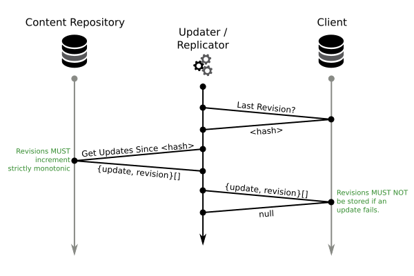

==========
Replicator
==========

This document describes a common synchronization mechanism between two systems,
which can cope with write failures, network downtimes and other types of
partitions. The approach only works with a single write master (Single Source
of Truth) and any number of read slaves.

In our case we want to use this approach to synchronize the content database
with a search index.

General Workings
================

The general scheme for synchronizations is fairly simple:

It generally can be described as a three step process:

1) Fetch last revision from target

   The target is asked for the last revision the target knows. This is the
   revision of the last successful write operation. For the first request the
   target may return something like ``null``.

2) Fetch all changes since that last revision from source

   The source (write-master) is asked for all updates since the last revision.
   A limit, to limit the transfer size, may also be applied. The results
   **must** be sorted by their revision.

3) Commit all updates on target

   All fetched updates are committed on the target. The target **must not**
   store a revision if the corresponding update did not succeed.

   This is usually possible to implement using transactions. Another way is to
   store the revision directly in the received update (document). This way, if
   the document update is lost, the revision will also be "lost".

Revisions
---------

Revisions **must** always be **globally strictly monotonically** increasing.

If you have only one write-master time (including milliseconds) might work,
unless there are multiple commits in the same millisecond or some NTP daemon
stops time or makes it go backwards. Time will never be synchronous across
multiple systems, so **do not** rely on that.

A simple auto-increment in the write-master might be the simplest solution. You
should take care for possible overflows, though. The revision might increase
quite fast in scenarios with a lot of updates.

Idempotent Updates
------------------

In some cases it is helpful if all updates are idempotent, thus applying the
same update multiple times does no harm.

In this case the last revision on the target system can be reset without
resetting the full storage. This can be helpful for graceful recovery of the
target system.

Compaction
----------

One problem with this approach is that if the replication target had gone away
every revision of every document will be re-transmitted in order. This can lead
to quite long initializations.

An option commonly used is to compact the database, thus removing deleted
objects and older revisions so that they won't be re-transmitted. One must pay
attention to not affect data integrity when doing this.

Implementation
==============

The process may stop and continue at any point. If a replication fails at any
point this is no problem if the process had been implemented correctly.

Thus the updater / replicator can be implemented as a daemon, cronjob or a
script triggered manually from time to time.

The updater / replicator generally can run anywhere, on the source system, on
the target system or on a dedicated system. The only respective drawback might
be additional network latency.

The updater / replicator should not do any data processing itself. This way it
can be a very simple piece of software.

Protocol
--------

You basically can implement this using any protocol you want. We implemented
this using something like Json-RPC and XML-RPC. But you might come up with
anything else – the messages are fairly simple. The most complex task is
properly encoding the updates which need to be transfered.

Displaying Replication Status
=============================

Since the process of storing updates is not necessarily immediate anymore one
might want to give the user some impression on the replication status. To do
this one can store information about the last requested updates by the
replicator / updater on the source system. Imagine the following update
stream, while the updater requests 5 updates starting at revision 3::

    0 1 2 3 4 5 6 7 8 9
          ^--------
           ?since=2&limit=5

We now know the following:

1) The updates 0, 1 & 2 are definitely stored on the target system

2) The updates 3, 4, 5, 6 & 7 are currently in transfer. Their state on the
   target system is unclear until the next request for updates.

3) The updates 8 & 9 are pending and not yet transferred.

Given this information one could display the use the replication state of each
document (green, yellow, red). The only additional information to store is last
requested revision and the last transferred revision resulting from the
requested limit.

Summary
=======

The proposed updater / replicator mechanism is a very fail-safe approach to
replication. It introduces a slight overhead and delay but the updates will
always catch up on the target system. No updates will ever be lost, even some
of the systems go down (Eventual Consistency).

..
   Local Variables:
   mode: rst
   fill-column: 79
   End: 
   vim: et syn=rst tw=79
